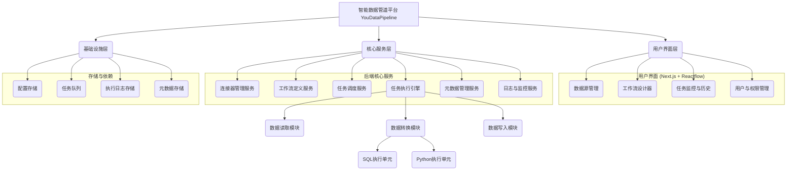
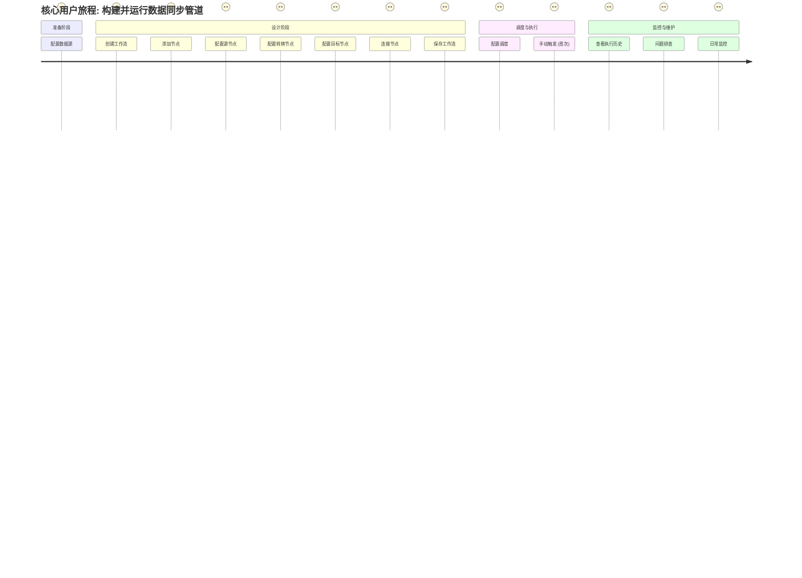
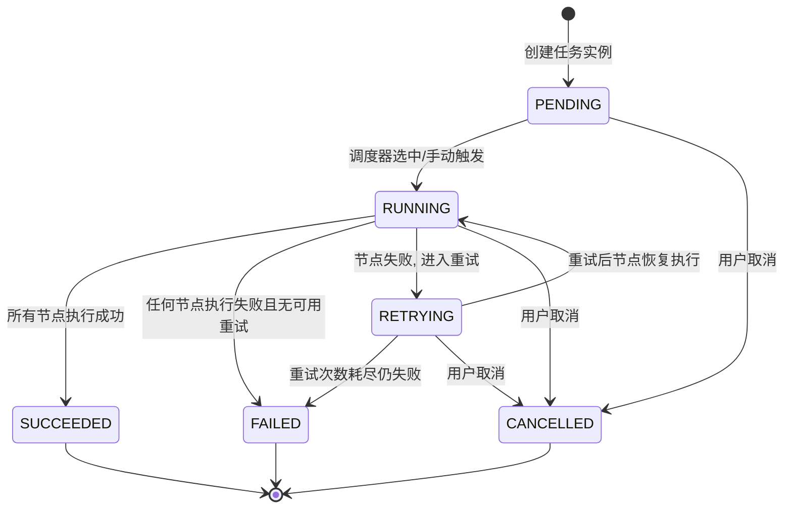

# 产品需求文档 (PRD)

## 1. 文档信息

### 1.1 版本历史

| 版本号 | 日期       | 作者     | 变更说明         |
| ------ | ---------- | -------- | ---------------- |
| V1.0   | {{YYYY-MM-DD}} | 产品经理 | 初稿创建         |

### 1.2 文档目的

本文档旨在明确定义“智能数据管道平台” (YouDataPipeline) 的产品需求，包括产品目标、功能规格、用户场景、非功能性需求等，作为产品设计、开发、测试和运营的依据。

### 1.3 相关文档引用

- [用户故事地图](User_Story_Map.md)
- [产品路线图](Roadmap.md)
- [产品评估指标框架](Metrics_Framework.md)

## 2. 产品概述

### 2.1 产品名称与定位

- **产品名称**: 智能数据管道平台 (YouDataPipeline)
- **产品定位**: 一个强大、易用、可视化的数据集成与处理平台，帮助用户高效地连接、同步、转换和管理来自不同数据源的数据，赋能数据驱动的决策。

### 2.2 产品愿景与使命

- **产品愿景**: 成为领先的数据集成解决方案，简化数据流动，释放数据价值。
- **产品使命**: 为用户提供稳定、高效、灵活的数据管道服务，降低数据集成门槛，提升数据处理效率。

### 2.3 价值主张与独特卖点 (USP)

- **价值主张**:
    - **可视化编排**: 通过拖拽式界面轻松构建复杂数据工作流，无需编写大量代码。
    - **多源异构支持**: 广泛兼容各类数据源和目标，满足多样化集成需求。
    - **高效稳定同步**: 提供可靠的全量及增量数据同步机制，确保数据一致性与时效性。
    - **灵活扩展处理**: 支持自定义SQL、Python脚本等进行数据转换和处理，满足个性化业务逻辑。
    - **智能监控运维**: 提供任务执行历史、状态监控和失败重试，保障数据管道稳定运行。
- **独特卖点 (USP)**:
    - 基于Reactflow的直观可视化工作流设计体验。
    - 贴源层数据一致性保障。
    - 灵活的节点扩展能力 (SQL, Python)。

### 2.4 目标平台列表

- **Web**: 主要管理与配置界面。
- 后端服务将在服务器上运行，具体操作系统和环境待定，但需具备跨平台部署能力 (如通过Docker容器化)。

### 2.5 产品核心假设

- 用户具备基础的数据概念和ETL/ELT流程认知。
- 用户需要处理来自多个不同类型数据源的数据。
- 用户对可视化、低代码/无代码的数据管道搭建方式有强烈需求。
- 用户关注数据同步的稳定性和数据一致性。

### 2.6 商业模式概述 (如适用)

- 初期：开源或提供免费版本，吸引用户，构建社区。
- 长期：可考虑提供企业版，包含高级功能、技术支持、SaaS服务等。

## 3. 用户研究

### 3.1 目标用户画像 (详细)

#### 3.1.1 用户画像1: 数据工程师 (Data Engineer)

- **人口统计特征**:
    - 年龄: 25-45岁
    - 教育背景: 计算机、软件工程、数据科学等相关专业本科及以上学历。
    - 职业: 主要在IT、互联网、金融、电商等数据密集型行业工作。
- **行为习惯与偏好**:
    - 熟练使用SQL、Python等编程语言。
    - 习惯使用各种数据工具和平台 (如Airflow, Informatica, Kettle, DataWorks等)。
    - 关注技术的先进性、稳定性和效率。
    - 喜欢自动化、可配置的解决方案。
    - 倾向于通过文档、社区和技术博客学习和解决问题。
- **核心需求与痛点**:
    - **需求**: 快速构建和维护数据管道；高效同步和转换大量数据；监控数据管道健康状况；确保数据质量和一致性。
    - **痛点**: 传统ETL工具配置复杂、学习曲线陡峭；手写脚本维护成本高、易出错；异构数据源集成繁琐；缺乏统一的监控和告警机制。
- **动机与目标**:
    - 提升数据处理效率，减少重复劳动。
    - 保障数据按时、准确地流向目标系统。
    - 为数据分析师和业务团队提供高质量的数据支持。

#### 3.1.2 用户画像2: 数据分析师 (Data Analyst) / 业务分析师 (Business Analyst)

- **人口统计特征**:
    - 年龄: 22-40岁
    - 教育背景: 统计学、数学、经济学、工商管理或相关领域，可能具备一定的技术背景。
    - 职业: 负责数据分析、报表制作、业务洞察等工作。
- **行为习惯与偏好**:
    - 熟练使用SQL进行数据查询和分析，可能掌握Python/R等分析工具。
    - 依赖BI工具 (如Tableau, Power BI, Superset) 进行数据可视化。
    - 希望能快速获取所需数据，减少对数据工程师的依赖。
    - 关注数据的易得性和准确性。
- **核心需求与痛点**:
    - **需求**: 能够自助式地获取和整合来自不同系统的数据；进行简单的数据清洗和转换；快速验证数据。
    - **痛点**: 获取数据流程繁琐，等待时间长；数据源分散，口径不一，整合困难；对复杂的数据工程任务力不从心。
- **动机与目标**:
    - 快速响应业务需求，提供数据洞察。
    - 提高数据分析的自主性和效率。

### 3.2 用户场景分析

#### 3.2.1 核心使用场景详述

1.  **场景1: 业务数据库数据同步到数据仓库**
    - **用户**: 数据工程师
    - **描述**: 公司业务系统 (如MySQL, PostgreSQL) 产生大量交易数据，需要每日定时将这些数据全量或增量同步到数据仓库 (如Hive, ClickHouse, Snowflake) 的贴源层 (ODS)，以供后续分析。
    - **流程**:
        1. 用户登录平台，进入数据源管理模块，配置业务数据库和数据仓库的连接信息。
        2. 用户进入工作流设计器，创建一个新的数据管道。
        3. 从工具箱拖拽一个“数据库”节点作为源，选择已配置的业务数据库，并设置同步表、同步方式（全量/增量）、增量字段等。
        4. 拖拽一个“目标”节点，选择已配置的数据仓库连接，并指定目标表名和加载策略。
        5. 连接源节点和目标节点。
        6. (可选) 在源和目标之间插入“SQL转换”节点或“Python脚本”节点，进行数据清洗、格式转换或简单计算。
        7. 保存并配置工作流的调度策略（如每日凌晨2点执行）。
        8. 启动工作流，系统按计划执行数据同步任务。
        9. 用户可以在执行历史中查看任务状态、日志和同步数据量。

2.  **场景2: API数据抽取与整合**
    - **用户**: 数据工程师 / 技术能力较强的数据分析师
    - **描述**: 需要从多个第三方SaaS服务商提供的API (如CRM API, 广告平台API) 中获取数据，并将其整合存储到内部数据库或数据湖中，用于统一分析。
    - **流程**:
        1. 用户配置API数据源，包括API Endpoint, 请求方法, Headers, 认证方式 (API Key, OAuth2)等。
        2. 在工作流设计器中，使用“API”节点作为数据源，配置API请求参数，如分页逻辑、时间范围等。
        3. (可选) 使用“Python脚本”节点处理API返回的JSON/XML数据，进行解析、结构化和字段映射。
        4. 将处理后的数据写入目标数据存储（如数据库表、文件）。
        5. 设置定时调度，定期拉取API数据。

3.  **场景3: 本地/FTP文件数据加载**
    - **用户**: 数据分析师 / 数据工程师
    - **描述**: 业务部门定期提供CSV或Excel格式的数据文件，存储在本地共享目录或FTP服务器上，需要将这些文件数据加载到数据库中进行分析。
    - **流程**:
        1. 用户配置“文件系统”或“FTP”数据源，指定文件路径、格式、编码等。
        2. 在工作流设计器中，使用相应的文件源节点，配置读取规则。
        3. (可选) 使用“数据转换”节点进行列名修改、数据类型转换等操作。
        4. 将数据加载到目标数据库表。

#### 3.2.2 边缘使用场景考量

- **一次性数据迁移**: 用户可能需要使用平台进行一次性的数据迁移任务。
- **小批量实时/准实时同步**: 对于某些对时效性要求较高的场景，可能需要支持更小时间间隔的调度或事件触发的同步。
- **复杂数据质量校验**: 在数据同步过程中执行复杂的数据质量规则校验。

### 3.3 用户调研洞察 (如适用)

- (待补充，可通过用户访谈、问卷调查等方式获取)

## 4. 市场与竞品分析

### 4.1 市场规模与增长预测

- 全球数据集成市场持续增长，企业对数据驱动决策的需求日益增强，推动了对ETL/ELT工具和平台的需求。
- 云数据仓库和数据湖的普及进一步加速了数据集成市场的发展。

### 4.2 行业趋势分析

- **云原生与SaaS化**: 数据集成工具向云端迁移，提供SaaS服务成为趋势。
- **ELT模式兴起**: 随着云数据仓库计算能力的增强，ELT (Extract, Load, Transform) 模式越来越受欢迎。
- **低代码/无代码**: 降低数据集成工具的使用门槛，使更多业务人员能够参与数据处理。
- **AI与自动化**: 利用AI技术实现数据映射自动化、异常检测、智能调度等。
- **DataOps理念**: 强调数据流程的自动化、协作和持续改进。
- **实时数据集成**: 对实时数据流处理和分析的需求增加。

### 4.3 竞争格局分析

#### 4.3.1 直接竞争对手详析

1.  **Apache Airflow**
    - **优势**: 开源、高度可编程和可扩展、庞大的社区支持、灵活的调度功能、Python友好。
    - **劣势**: 主要通过代码定义DAG，可视化能力相对较弱（虽有Web UI但主要用于监控），学习曲线较陡峭，环境部署和维护有一定复杂度。
    - **定价**: 开源免费，但部署和运维需要成本。
    - **特性对比**: 强大的编排和调度，但可视化ETL设计非其核心强项。

2.  **Apache NiFi**
    - **优势**: 强大的可视化数据流设计和管理界面、支持多种处理器、实时数据流处理能力强、数据溯源功能。
    - **劣势**: 对于复杂的批处理转换逻辑可能不如Airflow灵活，集群管理和性能调优有一定门槛。
    - **定价**: 开源免费。
    - **特性对比**: 核心是数据流处理，可视化能力强，但更侧重于“流”而非传统ETL的“批处理转换”。

3.  **Informatica PowerCenter / Informatica Cloud**
    - **优势**: 成熟的企业级解决方案、功能全面、稳定性高、广泛的连接器支持、强大的数据转换能力、完善的技术支持和服务。
    - **劣势**: 商业软件，价格昂贵；传统PowerCenter部署较重，云版本更灵活但仍有学习成本。
    - **定价**: 商业授权，价格较高。
    - **特性对比**: 功能强大但成本高，适合大型企业。

4.  **Talend Open Studio / Talend Cloud**
    - **优势**: 开源版本功能丰富、图形化界面易上手、拥有大量组件和连接器、社区活跃。
    - **劣势**: 开源版在企业级特性（如协作、高级调度、监控）上有限制，部分高级功能需付费版。
    - **定价**: 开源免费，提供商业版。
    - **特性对比**: 提供了良好的可视化ETL设计体验，是直接的有力竞争者。

5.  **AWS Glue / Azure Data Factory / Google Cloud Data Fusion**
    - **优势**: 与各自云平台深度集成、无服务器架构、按需付费、弹性伸缩。
    - **劣势**: 通常与特定云生态绑定较深，跨云或本地部署可能不便；部分功能可能不如专业ETL工具细致。
    - **定价**: 按使用量付费。
    - **特性对比**: 云厂商提供的托管服务，适合深度使用其云生态的用户。

6.  **Kettle (Pentaho Data Integration)**
    - **优势**: 开源、图形化界面、功能较为全面、社区存在一定时间。
    - **劣势**: 近年来发展相对缓慢，界面和体验可能略显陈旧，大规模部署和高性能场景下可能需要更多调优。
    - **定价**: 开源免费，有商业支持。
    - **特性对比**: 经典的开源ETL工具，提供了可视化设计。

7.  **DataWorks (阿里云)** / **DolphinScheduler (Apache)**
    - **优势**: DataWorks与阿里云生态集成紧密，功能强大；DolphinScheduler是国产优秀的开源调度平台，可视化DAG，支持多种任务类型。
    - **劣势**: DataWorks主要面向阿里云用户；DolphinScheduler更侧重调度，ETL转换能力需结合其他组件。
    - **定价**: DataWorks按量付费；DolphinScheduler开源。

#### 4.3.2 间接竞争对手概述

- **自定义脚本 (Python, Shell等)**: 许多小型团队或项目初期会采用脚本方式进行数据同步，灵活但维护性、可复用性差。
- **数据同步工具 (如DataX, Sqoop)**: 专注于数据同步，但在数据转换和复杂流程编排方面能力较弱。

### 4.4 竞品功能对比矩阵

| 特性             | YouDataPipeline (目标) | Airflow | NiFi    | Informatica | Talend (Open) | AWS Glue | Kettle  |
| ---------------- | ---------------------- | ------- | ------- | ----------- | ------------- | -------- | ------- |
| **可视化编排**   | ++ (Reactflow)         | +/-     | ++      | +           | ++            | +        | ++      |
| **多源支持**     | ++                     | + (代码) | ++      | ++          | ++            | +        | +       |
| **SQL节点**      | ++                     | + (Operator) | +/-     | ++          | ++            | +        | ++      |
| **Python节点**   | ++                     | ++      | + (Script) | +           | +             | ++       | + (Script) |
| **增量同步**     | ++                     | + (代码) | +       | ++          | ++            | +        | +       |
| **失败重试**     | ++                     | ++      | +       | ++          | +             | ++       | +       |
| **执行历史**     | ++                     | ++      | ++      | ++          | +             | ++       | +       |
| **贴源层一致性** | ++ (强调)              | +/-     | +/-     | +           | +             | +/-      | +/-     |
| **开源**         | 是 (计划)              | 是      | 是      | 否          | 是            | 否       | 是      |
| **易用性**       | ++ (目标)              | -       | +       | +/-         | +             | +        | +       |

*评分: ++ (强), + (中), +/- (一般/视情况), - (弱)*

### 4.5 市场差异化策略

- **极致的易用性与现代化的用户体验**: 基于Reactflow打造直观、流畅的可视化设计器，降低用户上手门槛。
- **强调贴源层数据一致性**: 将其作为核心特性进行保障和宣传。
- **灵活的自定义代码节点 (SQL, Python)**: 兼顾易用性与灵活性，满足专业用户深度定制需求。
- **轻量级与易部署**: 相比传统大型ETL工具，力求更轻量化，易于部署和维护，尤其适合中小型团队和快速迭代的项目。
- **社区驱动与开放生态**: 若开源，则积极构建开发者社区，鼓励贡献连接器和功能插件。

## 5. 产品功能需求

### 5.1 功能架构与模块划分

### 5.2 核心功能详述

#### 5.2.1 数据源管理模块 (DataSource Management)

- **功能描述**: 作为用户，我想要能够方便地添加、配置、测试、编辑和删除各种类型的数据源连接信息，以便在数据工作流中重复使用它们。
- **用户价值**: 集中管理数据源，避免重复配置，提高效率和准确性。
- **功能逻辑与规则**:
    - 支持的数据源类型：
        - **数据库**: MySQL, PostgreSQL, SQL Server, Oracle (优先支持前两者)
        - **大数据存储**: Hive, ClickHouse (优先支持Hive)
        - **NoSQL数据库**: MongoDB, Redis (作为未来扩展)
        - **Web API**: 支持RESTful API，可配置URL、请求方法、Headers、Body、认证方式 (None, Basic Auth, API Key, OAuth2 - 简化版优先)。
        - **文件系统**: 本地文件系统路径，共享网络路径 (如NFS, SMB - 视部署环境定)。
        - **FTP/SFTP**: FTP/SFTP服务器连接。
        - **消息队列**: Kafka, RabbitMQ (作为未来扩展)。
    - **配置项**: 每种数据源类型需要不同的配置参数 (参考 `data-source-configurator.tsx` 的实现，并进行扩展)。
        - 例如，数据库需要：主机、端口、数据库名、用户名、密码、连接串参数等。
        - API需要：Base URL、认证信息等。
        - 文件系统需要：根路径等。
    - **连接测试**: 提供“测试连接”功能，验证配置的有效性。
    - **安全性**: 敏感信息（如密码、API Key）应加密存储，并在UI上以掩码形式显示。
    - **列表展示**: 以列表形式展示已配置的数据源，包含名称、类型、创建时间、状态（是否可用）。
    - **操作**: 支持对数据源进行增删改查。
- **交互要求**: (参考 `data-source-configurator.tsx`)
    - 提供清晰的表单用于输入配置信息。
    - 根据选择的数据源类型动态显示相应的配置字段。
    - 测试连接结果应明确反馈给用户。
- **数据需求**: 数据源名称、类型、配置详情 (JSON格式存储)、创建/更新时间、创建者。
- **技术依赖**: 后端需要相应的连接驱动和库来实际执行连接测试。
- **验收标准**:
    - 成功添加至少一种数据库类型（如MySQL）的数据源，并测试连接成功。
    - 成功添加一种API类型的数据源，并测试连接（可模拟简单API服务）。
    - 成功添加一种文件系统类型的数据源。
    - 数据源列表能正确显示已添加的数据源信息。
    - 编辑数据源后，信息能被正确更新。
    - 删除数据源后，该数据源不再可用。
    - 敏感信息在存储和展示时得到妥善处理。

#### 5.2.2 可视化工作流设计器 (Visual Workflow Designer)

- **功能描述**: 作为用户，我想要通过拖拽的方式从工具栏选择不同类型的节点（数据源、转换、目标等）到画布上，并连接它们来构建数据处理流程，以便直观地设计和管理数据管道。
- **用户价值**: 降低数据管道构建门槛，提高设计效率，使流程更易理解和维护。
- **功能逻辑与规则**:
    - **画布**: 提供一个无限或可扩展的画布区域用于放置和连接节点 (基于Reactflow)。
    - **节点工具箱**: 左侧或顶部提供一个工具栏，包含所有可用的节点类型，用户可以拖拽到画布上。
        - **源节点 (Source)**:
            - 数据库源: 关联已配置的数据库数据源，可配置读取表、SQL查询、增量抽取条件 (如增量字段、时间窗口)。
            - API源: 关联已配置的API数据源，可配置具体路径、参数、请求体模板、分页处理方式。
            - 文件源: 关联已配置的文件数据源，可配置具体文件/文件夹路径、文件名模式匹配 (如通配符)、文件格式 (CSV, JSON, Parquet, Excel等)、编码。
            - FTP/SFTP源: 类似文件源，但需处理FTP/SFTP连接和路径。
            - 消息队列源 (未来): 关联消息队列，配置Topic、消费组等。
        - **转换节点 (Transformation)**:
            - **SQL转换节点**: 允许用户输入SQL语句，对上游节点输出的数据进行转换。输入可以是一个或多个表/视图（代表上游节点输出），输出是一个结果集。需要指定SQL方言（或由引擎自动判断）。
            - **Python脚本节点**: 允许用户编写Python脚本，对输入数据进行处理。提供输入数据框 (Pandas DataFrame) 和输出数据框的API。需要管理Python环境和依赖。
            - **字段映射节点**: 提供UI界面，让用户将输入字段映射到输出字段，可进行重命名、删除、修改数据类型、设置常量值等操作。
            - **过滤器节点**: 根据条件过滤数据行。
            - **聚合节点**: 对数据进行分组聚合操作 (SUM, COUNT, AVG, MIN, MAX)。
            - **连接 (Join) 节点**: 将多个输入数据流按照指定字段和连接类型 (Inner, Left, Right, Full) 进行合并。
            - **Union节点**: 合并多个结构相同的输入数据流。
        - **目标节点 (Destination/Sink)**:
            - 数据库目标: 关联已配置的数据库数据源，可配置写入表、写入模式 (追加Append, 覆盖Overwrite, 更新Update/Upsert)、主键/唯一键（用于更新）。
            - 文件目标: 关联已配置的文件数据源，可配置输出文件路径、文件名、格式、编码、写入模式 (追加, 覆盖)。
            - 消息队列目标 (未来): 写入指定消息队列的Topic。
            - **贴源层 (ODS) 目标**: 特殊类型的目标节点，强调保持与源数据结构一致（或尽可能一致），记录数据来源和同步时间戳。
    - **边的连接**: 用户可以通过从节点的Handle拖拽到另一个节点的Handle来创建边，表示数据流向。
        - 边应有方向箭头。
        - 需要进行连接有效性校验 (例如，目标节点不能有出度，源节点不能有入度，某些节点类型只能接受特定类型的输入)。
    - **节点配置**: 双击或选中节点后在右侧属性面板显示该节点的配置项。
        - 每个节点类型有其特定的配置参数。
        - 配置应实时保存或提供明确的保存按钮。
    - **工作流属性**: 可配置工作流名称、描述、调度参数（见5.2.3）。
    - **基本操作**: 保存工作流、另存为、加载已有工作流、删除工作流。
    - **画布操作**: 放大、缩小、适应画布、撤销、重做。
- **交互要求**: (参考 `enhanced-etl-designer.tsx`)
    - 拖拽体验流畅。
    - 节点和边的样式清晰，易于区分。
    - 配置面板交互友好，输入校验及时。
    - 提供对齐线、网格等辅助设计功能。
- **数据需求**: 工作流ID、名称、描述、节点列表 (每个节点包含ID, 类型, 位置, 配置参数)、边列表 (每个边包含ID, 源节点ID, 目标节点ID, 源Handle, 目标Handle)。节点配置参数以JSON格式存储。
- **技术依赖**: Reactflow库，后端用于保存和加载工作流定义。
- **验收标准**:
    - 能够从工具箱拖拽至少三种不同类型的节点（如数据库源、SQL转换、数据库目标）到画布。
    - 能够成功连接这些节点形成一个简单的数据流。
    - 能够为每个节点配置必要的参数（如数据库连接、表名、SQL语句）。
    - 成功保存工作流定义，并能重新加载。
    - 画布的基本操作（缩放、平移）功能正常。
    - 节点配置面板能正确显示并更新节点参数。

#### 5.2.3 数据同步机制 (Data Synchronization)

- **功能描述**: 作为用户，我想要为数据管道配置全量或增量同步策略，以便根据业务需求高效地同步数据，并确保目标端数据的准确性和时效性。
- **用户价值**: 满足不同场景下的数据同步需求，节省资源，提高同步效率。
- **功能逻辑与规则**:
    - **全量同步 (Full Synchronization)**:
        - 每次执行时，从源读取所有数据，并将其写入目标。
        - 目标端通常采用覆盖 (Overwrite) 模式。
        - 适用于数据量不大、或需要每日完整快照的场景。
        - 源节点需支持全量读取配置。
    - **增量同步 (Incremental Synchronization)**:
        - 每次执行时，只读取源端自上次同步以来发生变化或新增的数据。
        - 需要定义增量条件：
            - **基于时间戳字段**: 源表中有记录创建/更新时间戳的字段，系统记录上次同步的最大时间戳，本次同步读取大于该时间戳的数据。
            - **基于自增ID字段**: 源表中有自增ID，系统记录上次同步的最大ID，本次同步读取大于该ID的数据。
            - **基于分区 (Partition)**: 对于支持分区的源（如Hive表按天分区），可同步指定分区的数据。
            - **CDC (Change Data Capture)**: (高级功能，未来考虑) 通过监听数据库的binlog/WAL等日志来捕获变更数据。初期可不直接支持，但架构上应预留接口。
        - 目标端通常采用追加 (Append) 或更新/插入 (Update/Upsert) 模式。
        - 源节点需支持配置增量同步的策略和相关字段。
        - 系统需要持久化存储每个增量同步任务的“断点”信息 (如上次同步的最大时间戳/ID)。
    - **贴源层 (ODS) 数据一致性**: 
        - 对于同步到贴源层的数据，应尽可能保持与源端数据结构和内容的一致性。
        - 目标表应包含元数据字段，如：`dw_batch_id` (批次号), `dw_load_ts` (加载时间戳), `dw_source_system` (源系统标识)。
        - 对于增量同步，需要处理源端数据的删除操作（逻辑删除或物理删除，根据策略定）。
- **交互要求**:
    - 在源节点的配置中，提供选择同步方式（全量/增量）的选项。
    - 若选择增量，则显示相应的配置字段（如增量字段名、增量类型）。
- **数据需求**: 每个同步任务的增量断点信息。
- **技术依赖**: 后端执行引擎需要实现相应的全量和增量读取逻辑。
- **验收标准**:
    - 成功配置并执行一个全量同步任务，目标端数据与源端一致。
    - 成功配置并执行一个基于时间戳的增量同步任务：
        - 首次执行为全量（或指定初始范围）。
        - 后续执行只同步新增/变更的数据。
        - 目标端数据能正确反映源端的变化。
    - 贴源层目标表包含预期的元数据字段。

#### 5.2.4 任务调度与执行 (Task Scheduling & Execution)

- **功能描述**: 作为用户，我想要为已创建的数据工作流配置定时调度策略（如每日、每周、每月、指定时间间隔执行），或者能够手动立即执行工作流，以便自动化数据处理任务。
- **用户价值**: 实现数据管道的自动化运行，解放人力，保障数据按时更新。
- **功能逻辑与规则**:
    - **手动执行**: 用户可以在UI上选择一个工作流，点击“立即执行”按钮来触发一次性的任务运行。
    - **定时调度**: 
        - 支持CRON表达式进行灵活的定时配置。
        - 提供常用的预设选项，如：每小时、每日（指定时间）、每周（指定星期几和时间）、每月（指定日期和时间）。
        - 可配置调度任务的生效起止时间。
    - **任务队列**: 后端应有任务队列（如Celery, RabbitMQ, Kafka）来接收调度系统触发的任务和手动执行的任务。
    - **执行引擎**: 负责从任务队列中获取任务，解析工作流定义，并按照节点顺序和依赖关系执行数据处理逻辑。
        - **分布式执行 (未来)**: 对于大规模数据处理，考虑支持将任务分发到多个工作节点上并行执行。
        - **资源管理 (未来)**: 考虑任务执行的资源分配和隔离。
    - **任务状态**: 任务在执行过程中应有明确的状态：等待中 (Pending)、运行中 (Running)、成功 (Succeeded)、失败 (Failed)、已取消 (Cancelled)。
- **交互要求**:
    - 在工作流配置界面，提供调度配置区域。
    - UI上应有按钮触发手动执行。
    - 任务状态应在监控界面清晰展示。
- **数据需求**: 工作流的调度配置 (CRON表达式、起止时间等)，任务实例的执行状态、开始/结束时间、日志等。
- **技术依赖**: 后端需要一个调度组件 (如APScheduler, Celery Beat，或集成外部调度系统如DolphinScheduler/Airflow)，以及任务队列和执行引擎。
- **验收标准**:
    - 成功手动触发一个工作流并执行完成。
    - 成功配置一个每日定时调度任务，并在预定时间自动执行。
    - 任务执行状态（运行中、成功、失败）能被正确记录和展示。

#### 5.2.5 执行历史与监控 (Execution History & Monitoring)

- **功能描述**: 作为用户，我想要查看数据工作流的执行历史记录，包括每次运行的开始时间、结束时间、状态、运行时长、处理的数据量以及详细的执行日志，以便跟踪任务执行情况和排查问题。
- **用户价值**: 及时了解任务运行状况，快速定位和解决故障，保障数据管道的稳定性。
- **功能逻辑与规则**:
    - **执行历史列表**: 展示所有工作流或特定工作流的执行实例列表。
        - 列表项包含：工作流名称、任务实例ID、触发方式（手动/调度）、开始时间、结束时间、耗时、状态、操作（查看日志、重跑等）。
        - 支持筛选（按工作流名称、状态、时间范围）和排序。
    - **任务详情**: 点击某个执行实例，可以查看更详细的信息。
        - **概览**: 基本信息同列表项。
        - **节点状态**: 可视化展示工作流中每个节点的执行状态（成功、失败、运行中、未开始）、开始/结束时间、输入/输出数据行数（如果适用）。
        - **执行日志**: 提供完整的任务执行日志，包括每个节点的启动、结束信息，数据处理过程中的关键信息、错误堆栈等。
            - 日志应分级别 (INFO, WARN, ERROR)。
            - 支持按关键字搜索日志。
            - 支持下载日志文件。
    - **统计信息**: (可选) 提供工作流运行的统计图表，如成功率、平均耗时等。
    - **告警 (未来)**: 当任务失败或长时间未运行时，可通过邮件、钉钉等方式发送告警通知。
- **交互要求**:
    - 执行历史列表清晰易读。
    - 任务详情页面信息组织合理，日志易于查看和搜索。
    - 节点状态在工作流拓扑图上直观展示。
- **数据需求**: 任务实例ID、工作流ID、状态、时间信息、日志内容、各节点执行详情。
- **技术依赖**: 后端需要记录详细的执行日志和状态信息，并提供查询接口。
- **验收标准**:
    - 执行一个工作流后，能在历史列表中看到对应的执行记录。
    - 记录包含正确的开始/结束时间、状态和耗时。
    - 能够查看到任务的详细执行日志，包括INFO和ERROR级别的信息。
    - 如果任务失败，日志中应包含错误原因。
    - 节点执行状态能正确反映。

#### 5.2.6 失败重试机制 (Failure Retry Mechanism)

- **功能描述**: 作为用户，我想要为工作流或工作流中的特定节点配置失败重试策略（如重试次数、重试间隔），以便在发生临时性故障（如网络抖动、数据库瞬断）时，系统能够自动尝试恢复任务，提高成功率。
- **用户价值**: 增强数据管道的鲁棒性，减少因瞬时故障导致的人工干预。
- **功能逻辑与规则**:
    - **工作流级别重试**: 
        - 可在工作流配置中设置整个工作流失败后的重试次数和重试间隔时间。
        - 例如，重试3次，每次间隔5分钟。
    - **节点级别重试 (可选，更细粒度)**:
        - 可为工作流中的某些关键节点（特别是I/O密集型节点如数据源读取、目标写入）单独配置重试策略。
        - 节点重试优先于工作流重试。如果节点重试成功，则工作流继续执行；如果节点重试耗尽次数仍失败，则工作流标记为失败，再根据工作流级别策略决定是否重试整个工作流。
    - **重试策略**: 
        - 固定间隔重试。
        - 指数退避重试 (Exponential Backoff): 每次重试间隔时间逐渐增加，避免短时间内对下游系统造成过大压力。
    - **可重试错误 vs 不可重试错误**: 系统应能区分某些错误类型。例如，配置错误、SQL语法错误等不应重试；网络超时、数据库连接中断等可以重试。
- **交互要求**:
    - 在工作流配置或节点配置中，提供重试参数的输入字段。
    - UI上应能清晰展示任务当前的重试状态和次数。
- **数据需求**: 工作流/节点的重试配置，任务实例的当前重试次数。
- **技术依赖**: 任务调度和执行引擎需要实现重试逻辑。
- **验收标准**:
    - 配置一个工作流在失败后重试2次，间隔1分钟。
    - 模拟一个会导致临时失败的场景（如目标数据库暂时不可用）。
    - 观察到工作流在首次失败后，自动进行了2次重试。
    - 如果重试期间故障恢复，任务最终成功。
    - 如果重试次数耗尽仍失败，任务最终标记为失败。

### 5.3 次要功能描述 (可简化结构)

- **用户管理与权限控制 (未来)**: 多用户支持，角色与权限分配（如管理员、开发者、只读用户），确保操作安全和数据隔离。
- **版本控制 (未来)**: 对工作流定义进行版本管理，支持查看历史版本、回滚到旧版本。
- **参数化执行 (未来)**: 工作流支持定义参数，在手动执行或调度时传入不同的参数值，实现更灵活的复用。
- **导入/导出工作流 (未来)**: 支持将工作流定义导出为JSON/XML文件，或从文件导入。

### 5.4 未来功能储备 (Backlog)

- **更丰富的数据源连接器**: 如Salesforce, Google Analytics, 各类SaaS应用等。
- **更高级的数据转换组件**: 如数据清洗、数据质量校验、主数据管理等。
- **机器学习节点**: 支持集成ML模型进行预测或特征工程。
- **实时数据流处理**: 基于Flink/Spark Streaming等引擎支持实时数据管道。
- **A/B测试与灰度发布**: 针对工作流变更的部署策略。
- **数据血缘分析**: 可视化展示数据在不同工作流和节点间的流动关系。
- **智能告警与根因分析**: 基于AI的异常检测和故障诊断。

## 6. 用户流程与交互设计指导

### 6.1 核心用户旅程地图

### 6.2 关键流程详述与状态转换图

#### 工作流任务实例状态转换

### 6.3 对设计师 (UI/UX Agent) 的界面原型参考说明和要求

- **整体风格**: 简洁、专业、现代化。参考现有云服务控制台（如AWS, GCP, Azure）或主流SaaS应用的设计风格。
- **数据源配置 (`data-source-configurator.tsx`)**: 
    - 保持现有布局的清晰性。
    - 对于敏感信息字段（密码、Token），默认使用密码类型输入框，并提供“显示/隐藏”切换按钮。
    - “测试连接”按钮应有明确的加载状态和结果反馈（成功/失败信息）。
- **工作流设计器 (`enhanced-etl-designer.tsx`)**: 
    - **左侧节点面板**: 分类清晰（源、转换、目标等），图标具有辨识度。考虑加入搜索节点功能。
    - **画布**: 网格背景，提供对齐辅助线。节点样式应能区分不同类型，并能展示关键信息（如节点名称、类型）。选中节点、连接线时有明显高亮。
    - **右侧配置面板**: 当选中节点或画布时，动态显示对应的配置项。配置项应分组清晰，使用合适的控件（输入框、下拉选择、开关、代码编辑器等）。复杂配置（如SQL、Python脚本）应提供宽敞的编辑区域和语法高亮。
    - **顶部操作栏**: 包含工作流名称编辑、保存、执行、调度设置、缩放、撤销/重做等常用操作。
- **执行历史与监控页面**: 
    - **列表**: 使用表格展示，关键信息（如状态）使用不同颜色或图标区分。提供筛选和搜索功能。
    - **详情**: 任务概览清晰。日志展示区域应支持滚动、搜索、复制。若能在工作流拓扑图上高亮显示各节点执行状态则更佳。
- **一致性**: 字体、颜色、图标、按钮样式等在整个应用中保持一致。
- **响应式**: 优先保证桌面端大屏幕的体验，但关键信息展示在较小屏幕上也应可用。

### 6.4 交互设计规范与原则建议 (如适用)

- **及时反馈**: 用户的操作应有即时反馈（如加载状态、成功/失败提示）。
- **减少认知负荷**: 界面布局清晰，信息层级分明，避免不必要的复杂性。
- **容错性**: 允许用户撤销操作，对于破坏性操作（如删除）应有二次确认。
- **一致性**: 遵循平台统一的设计语言和交互模式。
- **可预见性**: 控件和交互行为应符合用户的预期。

## 7. 非功能需求

### 7.1 性能需求

- **UI响应**: 界面操作（如拖拽节点、打开配置面板）响应时间应小于200ms。
- **工作流加载**: 加载包含20个节点的工作流定义，时间应小于2秒。
- **任务调度**: 调度系统应能准时触发任务，延迟不超过5秒。
- **数据同步吞吐量**: (根据具体数据源和目标定，初期可设定一个基准目标)
    - MySQL to MySQL (同区域网络): 对于百万级数据量的表，全量同步应在数十分钟内完成（具体取决于表结构和网络）。
    - 增量同步，单次处理1万条记录，应在数分钟内完成。
- **并发执行**: 系统应能支持至少10个工作流并发执行（初期目标，可逐步提升）。
- **资源使用率**: 后端服务在空闲时CPU和内存占用应较低。

### 7.2 安全需求

- **数据源凭证安全**: 数据库密码、API Key等敏感信息必须加密存储（如使用AES-256），传输过程中使用HTTPS/SSL加密。
- **访问控制**: (配合用户管理模块) 不同用户对数据源、工作流、任务实例应有相应的访问和操作权限。
- **代码注入防护**: 对于SQL节点和Python脚本节点，需防范恶意代码注入风险。
    - SQL节点: 避免直接拼接字符串生成SQL，使用参数化查询或安全的SQL构造方式。对用户输入的SQL进行一定的校验。
    - Python节点: 考虑在沙箱环境中执行Python脚本，限制其文件系统访问、网络访问等权限。
- **依赖库安全**: 定期扫描项目依赖的第三方库，及时更新存在安全漏洞的版本。
- **日志安全**: 日志中不应记录明文密码等敏感信息。
- **Web安全**: 防范常见的Web攻击，如XSS, CSRF等 (Next.js框架已提供部分防护)。

### 7.3 可用性与可访问性标准

- **易用性**: 
    - 新用户能在30分钟内通过引导或文档完成第一个简单数据管道的创建和执行。
    - 界面引导清晰，错误提示友好且具有指导性。
    - 提供完善的产品文档和教程。
- **可靠性**: 
    - 系统7x24小时可用，核心服务年可用性目标 > 99.9%。
    - 任务调度和执行引擎稳定可靠，避免任务丢失或重复执行（除非配置了重试）。
- **可维护性**: 代码结构清晰，模块化设计，易于扩展和维护。日志记录充分，便于问题排查。
- **可访问性 (Accessibility, a11y)**: (未来逐步完善)
    - 遵循WCAG 2.1 AA级别标准，确保残障用户也能使用。
    - 支持键盘导航，提供ARIA属性，保证屏幕阅读器兼容性。

### 7.4 合规性要求

- **数据隐私**: 若处理涉及个人身份信息 (PII) 的数据，需考虑GDPR, CCPA等数据隐私法规的要求，如数据脱敏、匿名化、用户数据删除权等 (具体视产品部署和使用场景而定)。
- **行业法规**: 若应用于特定行业（如金融、医疗），可能需要遵守相应的行业数据安全和合规标准。

### 7.5 数据统计与分析需求 (埋点)

- **用户行为**: 
    - 页面访问量 (PV), 独立访客数 (UV)。
    - 主要功能使用频率：数据源创建次数、工作流创建次数、任务执行次数等。
    - 用户在工作流设计器中的行为：节点使用频率、平均节点数/工作流等。
- **任务执行**: 
    - 任务成功率、失败率。
    - 平均任务执行时长。
    - 各类型节点执行耗时分布。
    - 数据同步量统计。
- **系统性能**: 
    - API接口响应时间。
    - 数据库查询性能。
    - 任务队列积压情况。

## 8. 技术架构考量

### 8.1 技术栈建议

- **前端**: 
    - 框架: Next.js (已定)
    - UI组件库: Shadcn UI (已使用), Tailwind CSS (已使用)
    - 可视化流程: Reactflow (已使用)
    - 状态管理: Zustand / Jotai / Recoil (根据项目复杂度选择，或使用React Context)
    - 数据请求: SWR / React Query
- **后端**: (建议)
    - 语言: Python (生态丰富，数据处理库多) 或 Node.js (与前端技术栈统一，异步IO性能好) 或 Java/Go (高性能，强类型)
    - 框架 (Python示例): FastAPI / Flask / Django
    - 框架 (Node.js示例): NestJS / Express
    - ORM: SQLAlchemy (Python), Prisma (Node.js), TypeORM (Node.js)
- **数据库 (元数据存储)**: PostgreSQL / MySQL
- **任务队列**: RabbitMQ / Celery (with Redis/RabbitMQ broker) / Kafka
- **调度器**: APScheduler (Python内嵌) / Celery Beat / 或考虑集成外部如DolphinScheduler
- **日志系统**: ELK Stack (Elasticsearch, Logstash, Kibana) 或 Grafana Loki
- **部署**: Docker, Kubernetes (可选)

### 8.2 系统集成需求

- **身份认证**: 可考虑集成OAuth2/OIDC服务 (如Keycloak, Auth0) 进行统一身份认证。
- **监控告警**: 可集成Prometheus/Grafana进行系统监控，或集成Alertmanager/钉钉/邮件等进行告警通知。
- **外部存储**: 可能需要与对象存储 (S3, MinIO) 等进行交互，用于暂存大文件或备份。

### 8.3 技术依赖与约束

- 前端已选定Next.js和Reactflow。
- 后端需要能够支持多种数据库连接驱动和API客户端库。
- Python脚本节点执行环境需要考虑依赖管理 (如venv, conda, Docker容器)。

### 8.4 数据模型建议 (关键实体)

- **User**: (id, username, password_hash, email, role, created_at, updated_at)
- **DataSource**: (id, name, type, config_json, user_id, created_at, updated_at, last_test_status, last_test_time)
- **Workflow**: (id, name, description, user_id, created_at, updated_at, schedule_cron, is_active, nodes_json, edges_json)
- **WorkflowRun (TaskInstance)**: (id, workflow_id, status, trigger_type, start_time, end_time, duration_ms, logs_path, created_at, parameters_json)
- **NodeRun**: (id, workflow_run_id, node_id_in_workflow, status, start_time, end_time, input_rows, output_rows, error_message, logs)
- **IncrementalCheckpoint**: (id, workflow_id, source_node_id, checkpoint_key, checkpoint_value_json, updated_at)

## 9. 验收标准汇总

### 9.1 功能验收标准矩阵

| 模块             | 功能点                                 | 验收标准 (简述)                                                                 |
| ---------------- | -------------------------------------- | ------------------------------------------------------------------------------- |
| 数据源管理       | 添加/编辑/删除/测试数据库源            | 成功操作，连接测试通过，敏感信息安全处理                                          |
|                  | 添加/编辑/删除/测试API源               | 成功操作，支持不同认证方式                                                      |
|                  | 添加/编辑/删除文件/FTP源               | 成功操作                                                                        |
| 工作流设计器     | 拖拽节点、连接、配置                   | 流程构建顺畅，节点参数可配置，工作流可保存加载                                    |
|                  | SQL转换节点                            | 可输入SQL并对上游数据执行转换                                                     |
|                  | Python脚本节点                         | 可输入Python脚本并对上游数据执行转换                                                |
| 数据同步         | 全量同步                               | 目标数据与源一致                                                                |
|                  | 增量同步 (时间戳/ID)                   | 首次全量/后续增量，数据准确                                                       |
|                  | 贴源层元数据                           | 目标表包含dw_batch_id, dw_load_ts等                                               |
| 任务调度与执行   | 手动执行                               | 任务能被立即触发并执行                                                          |
|                  | 定时调度 (CRON)                        | 任务在预定时间自动执行                                                          |
| 执行历史与监控   | 查看执行列表和详情                     | 记录完整，状态、时间、日志准确                                                    |
|                  | 查看节点状态和日志                     | 可定位到具体节点的执行情况和日志                                                  |
| 失败重试         | 工作流/节点失败自动重试                | 根据配置的次数和间隔进行重试，临时故障恢复后任务成功                                |

### 9.2 性能验收标准

- UI响应时间 < 200ms。
- 工作流加载 < 2s (20节点)。
- 并发执行10个工作流。
- (具体数据同步吞吐量根据基准测试确定)。

### 9.3 质量验收标准

- **Bug密度**: 关键模块 Bug 密度 < X 个/KLOC (需定义X)。
- **代码覆盖率**: 核心模块单元测试覆盖率 > 80%。
- **文档完整性**: 用户文档、API文档、架构文档齐全。

## 10. 产品成功指标

### 10.1 关键绩效指标 (KPIs) 定义与目标

- **用户增长**: 
    - MAU (月活跃用户数): 目标 YoY 增长 X%
    - 新注册用户数: 目标 每月 Y 个
- **用户参与度**: 
    - 平均工作流创建数/用户: 目标 Z 个
    - 平均任务执行次数/用户/月: 目标 W 次
    - 日均在线时长 (DAOT): 目标 V 分钟
- **任务成功率**: 
    - 整体任务执行成功率: > 99%
    - 首次执行成功率: > 95%
- **平台稳定性**: 
    - 系统可用性 (Uptime): > 99.9%
    - P0/P1级故障数: < N 个/季度
- **用户满意度**: 
    - NPS (净推荐值): 目标 > 40
    - 用户反馈问题解决率: > 90%

### 10.2 北极星指标定义与选择依据

- **北极星指标**: **成功执行的任务数** (或 **成功处理的数据量**)
- **选择依据**: 该指标直接反映了产品核心价值的实现——帮助用户成功、可靠地完成数据处理和同步。它的增长意味着用户更频繁、更深入地使用产品来解决实际问题，从而带动其他相关指标（如用户活跃度、数据源连接数、工作流复杂度等）的提升。

### 10.3 指标监测计划

- **数据收集**: 通过应用内埋点、后端日志、数据库记录等方式收集原始数据。
- **数据存储与处理**: 将数据汇总到数据仓库或分析平台。
- **数据可视化与报告**: 使用BI工具 (如Superset, Metabase, 或自建看板) 展示核心指标，生成日报、周报、月报。
- **监控频率**: 
    - 核心业务指标 (任务成功率、系统可用性): 实时/准实时监控与告警。
    - 用户行为指标: 日/周维度分析。
    - 长期趋势指标: 月/季度维度回顾。

---
**文档结束**